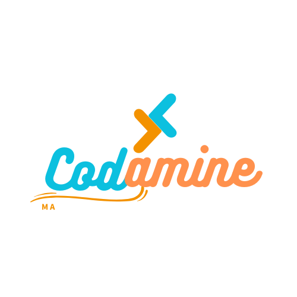

<p align="left">
  
</p>

# Vier Gewinnt (Connect Four)

A simple implementation of the classic **Vier Gewinnt** (Connect Four) game in **Java**. This game allows players to compete in two modes:
- **Mensch vs. Mensch** (Human vs. Human)
- **Mensch vs. KI** (Human vs. AI)

The project demonstrates core object-oriented programming principles, including inheritance and abstraction.

---

## Features

- **Game Modes**:
  - Play against another human player.
  - Play against an AI opponent.
- **Dynamic Board**:
  - The board dynamically updates after each move.
  - Displays the current state in the console.
- **Win Detection**:
  - Checks for vertical, horizontal, and diagonal wins.
- **Input Validation**:
  - Ensures valid moves and provides feedback for invalid inputs.

---

## Technology Stack

- **Language**: Java
- **IDE**: Any IDE that supports Java (e.g., IntelliJ IDEA, Eclipse, or VS Code)

---

## Example Gameplay

### Game Start 

```mathematica
Ein Game Mode Auswählen: 
1. Für Mensch vs. Mensch
2. Für Mensch vs. KI
```

### During Game 

```sql
Spieler_1 ist am Zug. Sein Zeichen ist X
Geben die Spalte ein:  
3
-----------------------------
|   |   |   |   |   |   |   |
|   |   |   |   |   |   |   |
|   |   |   |   |   |   |   |
|   |   |   |   |   |   |   |
|   |   |   |   |   |   |   |
|   |   |   |   |   |   |   |
|   |   |   | X |   |   |   |
-----------------------------

```

